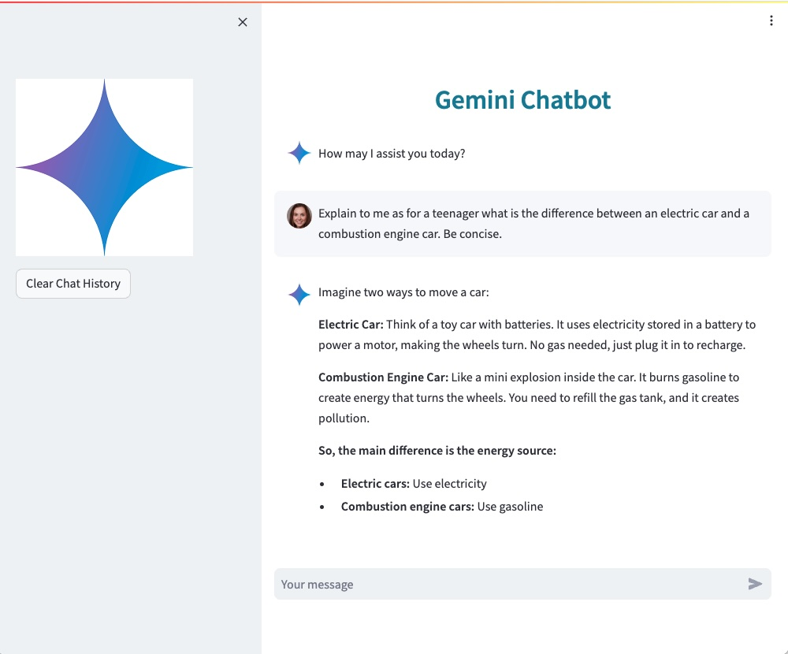

# Introduction

Gemini Chatbot demonstrate how to quickly build and deploy a chatbot powered with Gemini.  
The user interface is developed using Streamlit.
The application is deployed with App Engine.


# Start app

From root:

```streamlit run --server.port 8080 --server.enableCORS false --server.enableXsrfProtection=false --server.enableWebsocketCompression=false app.py```